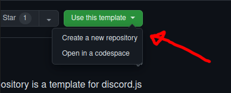

# Discord.JS template for typescript

This is a TypeScript bot template for Discord.JS,
it contains the basic utilities such as command registering and interaction/event handing.

You may extend the content of this template to create your own customized bot.

## Getting started

To get started, create a copy of the repository template, then you may clone the copy repository.



then you may clone it using the following command

```bash
git clone https://github.com/$your_user_name/$your_repo_name
cd $your_repo_name
```

and then open it with your favorite editor

```bash
# whether is vscode
code .
# or webstorm
webstorm .
```

Before touching any code, you should install all the dependencies for this bot.

```bash
npm install
```

after running this command you can see that a file named `.env` has been created, you may fill it now.

```dotenv
# you can get these values in https://discord.dev

TOKEN="" # your discord bot token should go here.
APPID="" # your discord application id should go here.
```

**THIS FILE SHOULD NEVER BE PUSHED TO YOUR GITHUB REPOSITORY** thus it's added in the `.gitignore`.

## Starting the bot

npm scripts are configured in this repository `package.json`, you may run the following.

```bash
npm run start
```

if your `.env` file is correctly set, you should have a `/ping` command available.

## Adding implementations

Implementations in this template are really simple, and typescript should hint you to make them correctly.

You may create a file under `commands/**/*` to create a slash command,
or a file under `events/**/*` to create an event handler.

To define what are you exporting, you may export one of the following objects,
otherwise the handler will ignore your export.

Inside `commands/**/*` you may place one of the following default exports

```ts
export default new SlashCommand({
    builder: new SlashCommandBuilder(),
    
    async handler(): Promise<void> {
        
    }
});
```

```ts
export default new UserCommand({
    builder: new ContextMenuCommandBuilder(),

    async handler(): Promise<void> {
		
    }
});
```

```ts
export default new ButtonInteraction({
    componentId: "",
    
    async handler(): Promise<void> {
		
    }
});
```

```ts
export default new SelectMenuInteraction({
    componentId: "",
    
    async handler(): Promise<void> {
		
    }
})
```

To access the executing client or the interaction, `this` is bound with the corresponding context for each interaction.
For example,
you may access the interaction using  `this.context` and you will have access to it's `reply()` method and more.

Inside the `events/**/*` you may place one of the following default exports

```ts
export default new Event({
    event: Events.ClientReady,
    
    async handler(): Promise<void> {
		
    }
});
```

